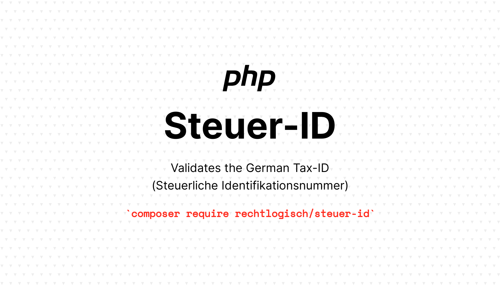

[](https://packagist.org/packages/rechtlogisch/steuer-id)
[](https://github.com/rechtlogisch/steuer-id/actions/workflows/run-tests.yml)
[](https://packagist.org/packages/rechtlogisch/steuer-id)

# steuer-id

> Validates the German Tax-ID (Steuerliche Identifikationsnummer)

Based on the [official ELSTER documentation](https://download.elster.de/download/schnittstellen/Pruefung_der_Steuer_und_Steueridentifikatsnummer.pdf) (chapter: 2; as of 2024-03-01).

## Installation

You can install the package via composer:

```bash
composer require rechtlogisch/steuer-id
```

## Usage

```php
isSteuerIdValid('02476291358'); // => true
```

or

```php
use Rechtlogisch\SteuerId\SteuerId;

(new SteuerId('02 476 291 358'))
    ->validate() // ValidationResult::class
    ->isValid(); // => true
```

Hint: Whitespaces are being ignored.

### Test-Steuer-IDs

Support for test Steuer-IDs (starting with `0`) is enabled by default. Test Steuer-IDs are usually invalid in production. It is recommended to disable them with the following environment variable:

```bash
STEUERID_PRODUCTION=true
```

or in PHP:

```php
putenv('STEUERID_PRODUCTION=true');
```

## Validation errors

You can get a list of errors explaining why the provided input is invalid with:

```php
validateSteuerId('x2476291358')->getErrors(); // => ['Only digits allowed.']
```
or

```php
use Rechtlogisch\SteuerId\SteuerId;

(new SteuerId('x2476291358'))
    ->validate()
    ->getErrors(); // => ['Only digits allowed.']
```

Hint: `validateSteuerId('...')` and `(new SteuerId('...'))->validate()` return a `ValidationResult::class` object.

## Testing

```bash
composer test
```

## Changelog

Please see [CHANGELOG](CHANGELOG.md) for more information on what has changed recently.

## Contributing

Please see [CONTRIBUTING](https://github.com/rechtlogisch/.github/blob/main/CONTRIBUTING.md) for details.

## Security Vulnerabilities

If you discover any security-related issues, please email open-source@rechtlogisch.de instead of using the issue tracker.

## Credits

- [Krzysztof Tomasz Zembrowski](https://github.com/zembrowski)
- [All Contributors](../../contributors)

## License

The MIT License (MIT). Please see [License File](LICENSE.md) for more information.
